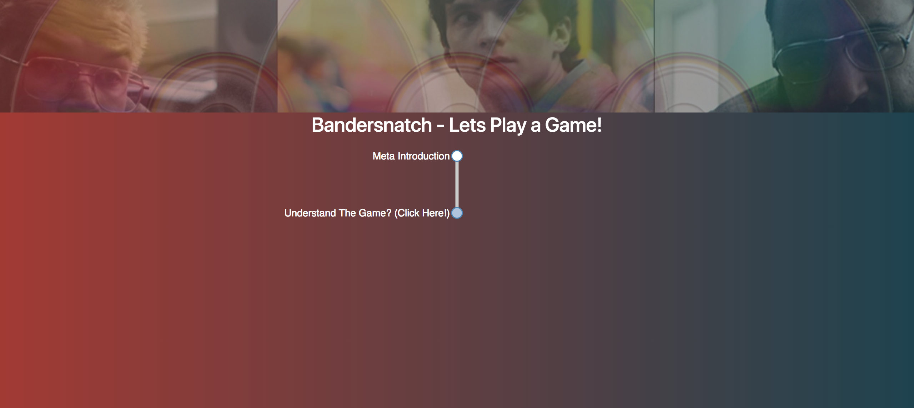
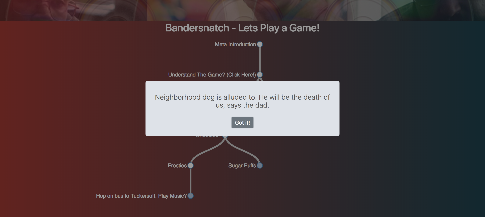
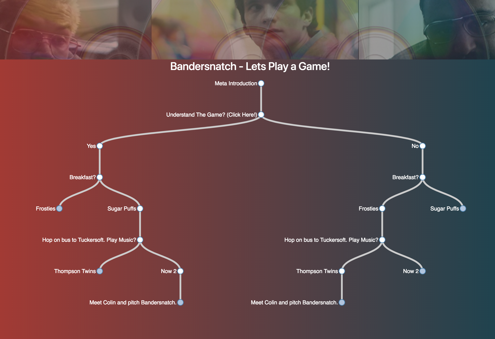

# :computer: Bandersnatch :movie_camera:
[Bandersnatch Life](http://bandersnatch.life) is an interactive website for the movie Black Mirror: Bandersnatch by Netflix. [Bandersnatch Life](http://bandersnatch.life) allows you to explore all possible paths in an interactive way - and in my opinion is a must to fully absorb all possible outcomes of the movie! 

## Table of Content :blue_book:	
   * [<g-emoji class="g-emoji" alias="computer" fallback-src="https://github.githubassets.com/images/icons/emoji/unicode/1f4bb.png">💻</g-emoji> Bandersnatch <g-emoji class="g-emoji" alias="movie_camera" fallback-src="https://github.githubassets.com/images/icons/emoji/unicode/1f3a5.png">🎥</g-emoji>](#computer-bandersnatch-movie_camera)
      * [Table of Content <g-emoji class="g-emoji" alias="blue_book" fallback-src="https://github.githubassets.com/images/icons/emoji/unicode/1f4d8.png">📘</g-emoji>](#table-of-content-blue_book)
      * [Features <g-emoji class="g-emoji" alias="sparkles" fallback-src="https://github.githubassets.com/images/icons/emoji/unicode/2728.png">✨</g-emoji> <g-emoji class="g-emoji" alias="sunglasses" fallback-src="https://github.githubassets.com/images/icons/emoji/unicode/1f60e.png">😎</g-emoji>](#features-sparkles-sunglasses)
      * [<g-emoji class="g-emoji" alias="camera" fallback-src="https://github.githubassets.com/images/icons/emoji/unicode/1f4f7.png">📷</g-emoji> Demo and Screenshots <g-emoji class="g-emoji" alias="video_camera" fallback-src="https://github.githubassets.com/images/icons/emoji/unicode/1f4f9.png">📹</g-emoji>](#camera-demo-and-screenshots-video_camera)
      * [Usage <g-emoji class="g-emoji" alias="video_game" fallback-src="https://github.githubassets.com/images/icons/emoji/unicode/1f3ae.png">🎮</g-emoji>](#usage-video_game)
      * [Contributing <g-emoji class="g-emoji" alias="fire" fallback-src="https://github.githubassets.com/images/icons/emoji/unicode/1f525.png">🔥</g-emoji>](#contributing-fire)
      * [Tools <g-emoji class="g-emoji" alias="eyeglasses" fallback-src="https://github.githubassets.com/images/icons/emoji/unicode/1f453.png">👓</g-emoji>](#tools-eyeglasses)
      * [Future Plans <g-emoji class="g-emoji" alias="soon" fallback-src="https://github.githubassets.com/images/icons/emoji/unicode/1f51c.png">🔜</g-emoji>](#future-plans-soon)
      * [Current Website Hierarchy <g-emoji class="g-emoji" alias="muscle" fallback-src="https://github.githubassets.com/images/icons/emoji/unicode/1f4aa.png">💪</g-emoji>](#current-website-hierarchy-muscle)
      * [<g-emoji class="g-emoji" alias="man_dancing" fallback-src="https://github.githubassets.com/images/icons/emoji/unicode/1f57a.png">🕺</g-emoji> Collaborators & Contributors <g-emoji class="g-emoji" alias="dancer" fallback-src="https://github.githubassets.com/images/icons/emoji/unicode/1f483.png">💃</g-emoji>](#man_dancing-collaborators--contributors-dancer)
      * [Inspiration <g-emoji class="g-emoji" alias="notebook" fallback-src="https://github.githubassets.com/images/icons/emoji/unicode/1f4d3.png">📓</g-emoji>](#inspiration-notebook)
      * [License <g-emoji class="g-emoji" alias="books" fallback-src="https://github.githubassets.com/images/icons/emoji/unicode/1f4da.png">📚</g-emoji>](#license-books)

## Features :sparkles: :sunglasses:

Currently, [Bandersnatch Life](http://bandersnatch.life) supports the following:

* Informational Notifications - Some are Timed

* Paths Explorations

* Paths Collapse

* Page Scaling
  
* Vertical and Horizontal Scrolling

## :camera: Demo and Screenshots :video_camera:

[Bandersnatch Life](http://bandersnatch.life)                           | [Bandersnatch Life](http://bandersnatch.life)
:-------------------------:|:-------------------------:
   |  
  |  

## Usage :video_game:

This website is written in **Javascript** with help of D3.js. Data in JSON and its related scripts are in **Python 3.7**

* `git clone https://github.com/Ahmad-Magdy-Osman/Bandersnatch.git`

* `cd Bandersnatch`

* `Run index.html`

## Contributing :fire:

1. :spaghetti: Fork this repo!
2. Clone and `cd` into it
3. Create your feature branch: `git checkout -b my-new-feature`
4. Commit your changes: `git commit -m 'Add some feature'`
5. Push to the branch: `git push origin my-new-feature`
6. Submit a pull request :+1:

## Tools :eyeglasses:
Programming languages, formats, and libraries.
  * HTML
    * Bootstrap
  * CSS
  * Javascript
    * D3.JS
    * Sweetalert 2
  * Python 3
  * JSON

## Future Plans :soon:
Based on given feedback, the following improvements are to be made/considered. Please feel free to pick any of them and start working on improving it as a contribtor.

* General
    * Mobile Responsiveness
    * Save user session with all visited paths
* Notifications
    * Wait time
    * Change notifications into rounded boxes(popover, toolbox), with hover-over focus, that reside over the center of the links
* Graphics
    * Horizontal Scrolling (overriding the overflow of the body element by the svg's element)
    * Auto-focus on new choices
    * Zooming in and out
        * Maybe zoom out of the previous nodes while still zoom in on the new ones to make all of them fit on screen?
    * Expand everything!
    * Left to right paths
        * Maybe as an option?
    * Text wrapping 
* Content
    * Which cereal video ad is played
    * Overriding not to talk about the mom path
* Marketing
    * SEO
    * Share on Social Media button
* Style/Design
    * Fonts
    * Footer
    * Links and Nodes Color
* Read Me
    * Add contributors

## Current Website Hierarchy :muscle:

* Single page with paths and notifications.
  
* More to come...

## :man_dancing: Collaborators & Contributors :dancer:

[ <b>Ahmad M. Osman</b>](https://github.com/Ahmad-Magdy-Osman) 

## Inspiration :notebook:

> ##### You will fail.
> 
> You will mess up.
> 
> You'll do poorly on assignments and tests.
> 
> Your side projects will not work.
> 
> Your code will be sloppy and incomplete.
> 
> You will bomb job interviews.
> 
> Your PR's will be rejected.
> 
> And because you fail, you will succeed.
> 
> Don't be afraid to fail, don't let it destroy your self-confidence, don't let it define you. Instead, do everything you can to learn from that failure and take that new knowledge into the next piece of work.
> 
> Indeed, failure is the only path to success.

        ― Stranger on the Internet.

## License :books:

[Bandersnatch Life](http://bandersnatch.life) is an open source project under MIT license. [Bandersnatch Life](http://bandersnatch.life)  is a fan work of Netflix's Black Mirror: Bandersnatch - any assets used are copylefted and should fall under fair use policy. Special thanks to /u/alpine-.
